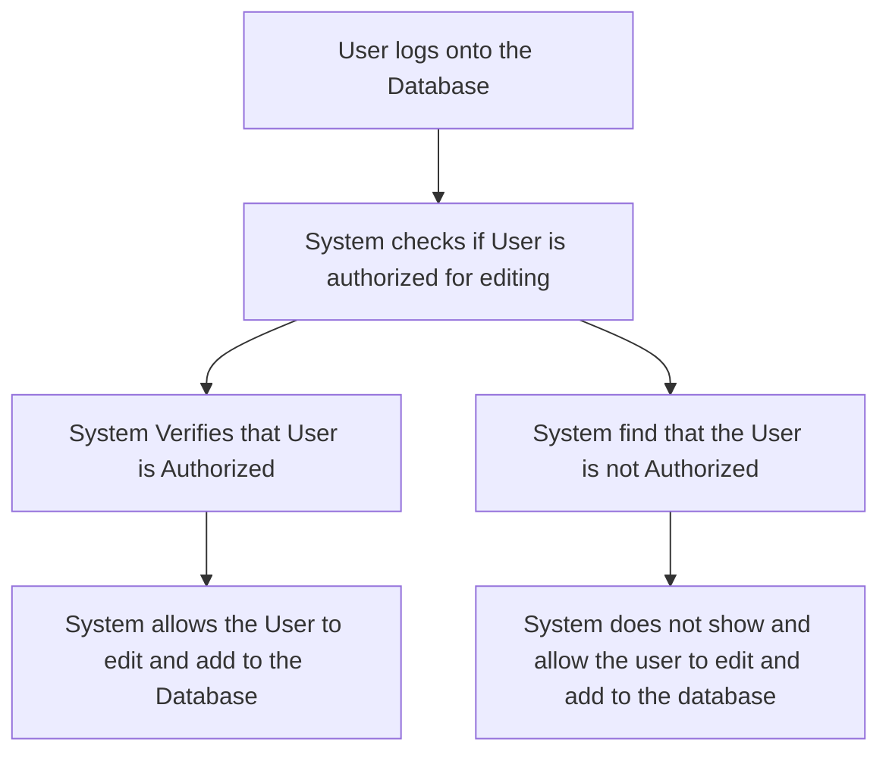

# Database editing  for Authorized persons

```mermaid
flowchart TD
A[User logs onto the Database]
B[System checks if User is authorized for editing]
C[System Verifies that User is Authorized]
D[System find that the User is not Authorized]
E[System does not show and allow the user to edit and add to the database]
F[System allows the User to edit and add to the Database]

A-->B
B-->C
B-->D
C-->F
D-->E
```
